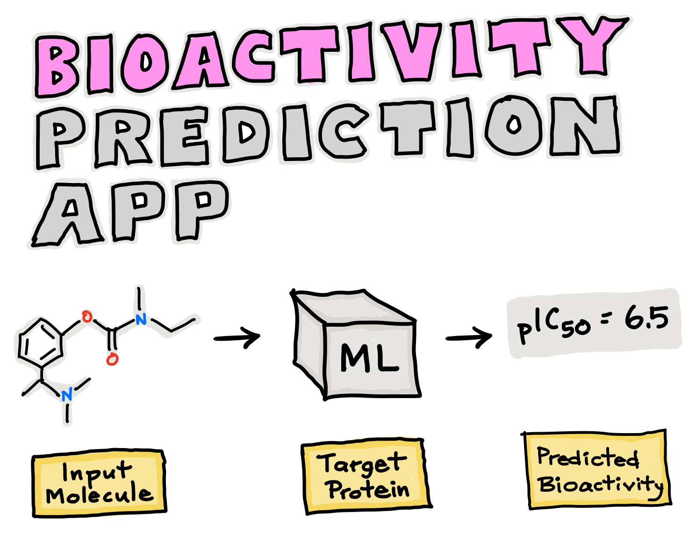

# KindPharm: Predictive Bioactivity Model

## Abstract

KindPharm is a machine learning model developed by Team H14 at WIEHACK5.0 IEEE BVP with the aim of revolutionizing drug discovery processes. By leveraging FDA-approved drug data, our model predicts the bioactivity of different chemical compounds on target enzymes and proteins within the human body. Traditional drug design often involves heavy investments of time and financial resources, with high failure rates during the research and development (R&D) phase. Our model seeks to streamline this process by efficiently analyzing a vast spectrum of available drugs and reducing the likelihood of R&D failures.

## Problem Solved

The traditional drug discovery process is time-consuming, costly, and prone to high failure rates. Researchers typically invest significant resources in screening and testing numerous chemical compounds for their bioactivity against specific target enzymes and proteins. However, this approach often results in many compounds being discarded due to lack of efficacy or safety concerns, leading to wasted resources and prolonged development timelines.

KindPharm addresses these challenges by providing a data-driven approach to drug discovery:

1. **Efficient Screening**: Our model efficiently analyzes large datasets of FDA-approved drug data, enabling researchers to quickly identify potential candidates for further study.

2. **Reduced R&D Costs**: By accurately predicting the bioactivity of chemical compounds, our model helps reduce the need for extensive experimental testing, thereby lowering R&D costs.

3. **Minimized Failure Rates**: By focusing resources on compounds with higher predicted bioactivity, our model minimizes the likelihood of R&D failures, allowing researchers to prioritize the most promising candidates for further development.

4. **Streamlined Drug Design**: KindPharm streamlines the drug design process by providing researchers with actionable insights into the bioactivity of chemical compounds, facilitating faster decision-making and accelerating the development of new drugs.

With KindPharm, researchers can optimize their drug discovery efforts, leading to more efficient development processes and ultimately, the discovery of novel therapeutics to improve human health.
